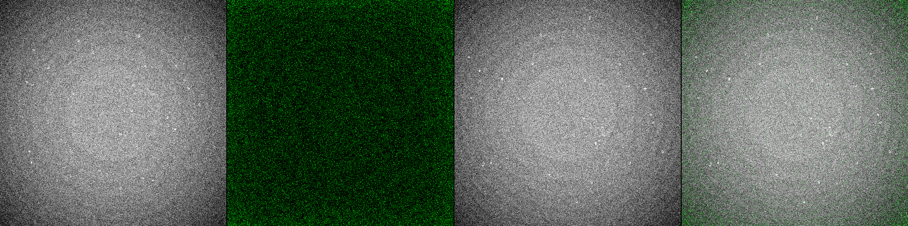
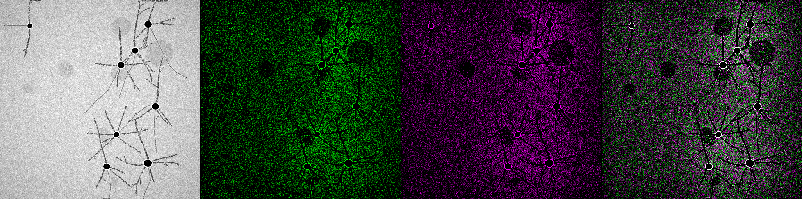
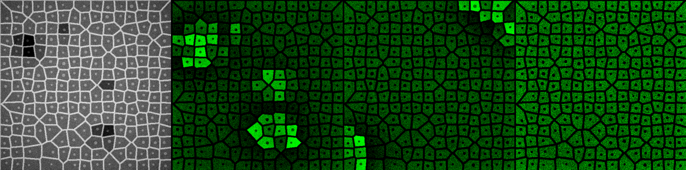
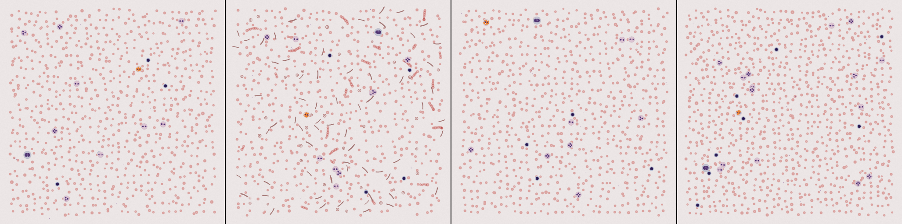
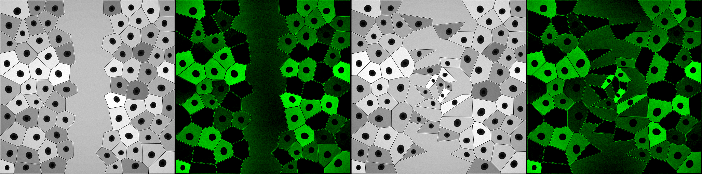
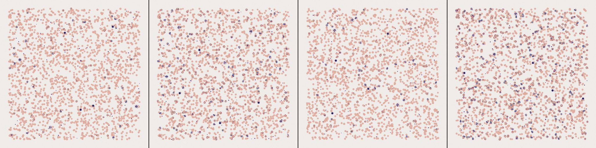

# Virtual Microscope

A fully simulated microscope platform that generates realistic microscopy images — no hardware required. Each backend simulates a different biological specimen with brightfield, fluorescence, and specialty imaging modes, all compatible with the [pymmcore-plus](https://github.com/pymmcore-plus/pymmcore-plus) device interface.

## Gallery

| | | |
|:---:|:---:|:---:|
|  |  |  |
| **bacteria** | **neuron** | **calcium** |
|  |  |  |
| **blood_smear** | **wound_healing** | **malaria** |

See the [full gallery](docs/gallery/gallery.md) for all 34 backends.

## Installation

```bash
pip install -e .
```

## Quick Start

### Via pymmcore-plus device API

```python
from virtual_microscope.backends import load_backend

core, sim = load_backend("bacteria", n_cells=50, seed=42)

# Switch channels
core.setConfig("Channel", "phase-contrast")
img = core.snap()  # numpy array (512, 512), uint8

core.setConfig("Channel", "GFP")
gfp = core.snap()

# Move the stage / adjust focus
core.setXYPosition(300, 400)
core.setPosition("Z", 5.0)
```

### Direct sim access (no device layer)

```python
from virtual_microscope.backends.bacteria import create_sim

sim = create_sim(n_cells=30, seed=42)
sim.mode = 0  # 0=phase-contrast, 1=GFP, 2=DAPI
img = sim.snap_frame(exposure=50.0, intensity=1.0)

# Dynamic sims advance their state each step
sim.step(dt=1.0)
```

## Architecture

```
load_backend("bacteria")
    │
    ▼
┌──────────────┐     ┌───────────────────┐     ┌─────────────┐
│  UniMMCore   │────▶│ SimulationBridge   │────▶│  BacteriaSim│
│ (device API) │     │ (snap/stage/focus/ │     │  (SimBase)  │
│              │     │  SLM/factory)      │     │             │
└──────────────┘     └───────────────────┘     └─────────────┘
        │                     │                       ▲
        │                     ▼                       │
        │              ┌──────────────┐        ┌──────────────┐
        │              │ SLMProcessor │        │RealtimeEngine│
        │              │ (decay field)│        │ (bg thread)  │
        │              └──────────────┘        └──────────────┘
        │
        ▼
  SimServer, Camera, XYStage, ZStage,
  LED, Filter Wheel, Objective, SLM,
  Temperature, NewExperiment ...
```

### Core components

| Component | Description |
|-----------|-------------|
| **`SimBase`** | ABC providing shared microscope state and rendering pipeline — objectives, FOV cropping, defocus blur, exposure model, photobleaching, z-drift. All microscope-style backends inherit from it. |
| **`SimulationBridge`** | Adapter between pymmcore device calls and the sim. Manages stage, focus, SLM masks, snap dispatch. Supports factory-based simulation recreation. |
| **`RealtimeEngine`** | Background thread driving `sim.step(dt)` at configurable tick rate. Thread-safe snap via mutex. Auto-starts for sims with `continuous = True`. Supports idle timeout and wake-on-snap. |
| **`SLMProcessor`** | Centralized SLM mask handling. Maps viewport masks to world coordinates, maintains an exponential-decay stimulation field, supports spatial-filter illumination mode. |
| **`OpticalPipeline`** | Per-channel post-processing: PSF convolution, Poisson-Gaussian noise, vignetting, photobleaching, debris overlay. |
| **`NewExperimentDevice`** | pymmcore device that triggers soft reset (`sim.reset()`) or full recreation via factory. |
| **`load_cfg()`** | Wires sim → bridge → core, loads `.cfg` device config, auto-starts `RealtimeEngine` for continuous sims. |

### Sim class hierarchy

```
SimBase (ABC)                      # base/sim_base.py
├── BacteriaSim                    # backends/bacteria/sim.py
├── CalciumSim                     # backends/calcium/sim.py
├── CardioSim                      # ...
├── BloodSmearSim
├── CelegansSim
├── DictyosteliumSim
├── FibroblastSim
├── HistologySim
├── MalariaSmearSim
├── MicrofluidicsSim
├── MitoSim
├── NeuronSim
├── OrganoidSim
├── PlantCellSim
├── ReactionDiffusionSim
├── SpheroidSim
├── SPTSim
├── VolvoxSim
├── YeastSim
├── ZebrafishSim
├── VoronoiSim                     # sims/voronoi/voronoi.py
│   └── DynamicVoronoiSim          # sims/voronoi/tissue_dynamics.py
│       (wound_healing, fish, fucci, lipid_droplet,
│        lysosome, stress_granule, viability)
└── ScatteredCellSim               # sims/cell/sim.py
    (particle backend)

Duck-typed (no SimBase):
  ColonySim, FlowCytometrySim, GelDocSim,
  HemocytometerSim, PlateReaderSim
```

### How a snap works

1. `core.snap()` calls `SimulationBridge.snap(exposure, brightness)`
2. Bridge passes SLM mask + device state to `sim.snap_frame()`
3. Sim renders at `internal_scale × world_size` (typically 4x)
4. `SimBase._crop_fov()` extracts the viewport region for the current objective and resizes to 512×512
5. `SimBase._apply_defocus()` applies Gaussian blur based on focal distance
6. `SimBase._apply_exposure()` scales brightness for BF vs fluorescence
7. `OpticalPipeline.apply()` adds noise, PSF, vignetting, photobleaching
8. Result is returned as `(512, 512)` uint8 (or `(512, 512, 3)` for stain-based backends like blood_smear)

### Real-time simulation

Backends with `continuous = True` automatically get a `RealtimeEngine` that advances the simulation in a background thread between snaps:

```python
core, sim = load_backend("bacteria")
# Engine is already running — sim.step(dt) called ~10x/sec in the background

import time
time.sleep(5)        # bacteria grow and divide for 5 seconds

img = core.snap()    # snapshot of the current state (thread-safe)
```

The engine supports:
- **Time scaling**: `bridge._engine.time_scale = 5.0` for 5x speed
- **Idle timeout**: auto-pauses after 30s without snaps, resumes on next snap
- **Pause/resume**: `bridge._engine.pause()` / `bridge._engine.resume()`

### SLM stimulation

```python
import numpy as np

core, sim = load_backend("calcium")
mask = np.zeros((512, 512), dtype=bool)
mask[200:300, 200:300] = True          # illuminate a square region
core.setSLMImage("SLM", mask.ravel())  # triggers calcium wave at target

# The stimulation field decays exponentially over time
```

### Simulation reset

```python
# Soft reset — same parameters, new random state
core.setProperty("NewExperiment", "Seed", "42")
core.setProperty("NewExperiment", "Action", "Reset")

# Hard reset — recreate from factory with fresh parameters
core.setProperty("NewExperiment", "Action", "New")
```

## Backends

| Backend | Description | Continuous | Channels |
|---------|-------------|:----------:|----------|
| `bacteria` | Rod-shaped bacteria, growth & division | yes | `phase-contrast`, `GFP`, `DAPI` |
| `blood_smear` | Wright-Giemsa stained peripheral blood | — | `wright-giemsa`, `membrane-aid`, `nuclei-aid` |
| `calcium` | Calcium wave propagation (FitzHugh-Nagumo) | yes | `phase-contrast`, `GCaMP`, `E-cadherin` |
| `cardio` | Cardiac tissue with calcium transients | yes | `phase-contrast`, `GCaMP`, `cell-junctions` |
| `celegans` | *C. elegans* sinusoidal locomotion | yes | `DIC`, `GFP-pharynx`, `mCherry-body` |
| `colony_counter` | Bacterial colony plates | — | `plate-image`, `blue-channel`, `gfp-channel` |
| `dictyostelium` | Dictyostelium aggregation, cAMP waves | yes | `dark-field`, `GFP`, `cAMP-reporter` |
| `fibroblast` | Fibroblasts with stress fibers, CytoD/LatA response | yes | `brightfield`, `DAPI`, `phalloidin` |
| `fish` | FISH probes on tissue sections | yes | `phase-contrast`, `DAPI`, `membrane` |
| `flow_cytometry` | Flow cytometry scatter & fluorescence | — | `scatter`, `FITC`, `PE` |
| `fucci` | FUCCI cell-cycle reporter | yes | `phase-contrast`, `mCherry-Cdt1`, `mVenus-Geminin` |
| `gel_doc` | Gel electrophoresis (western/agarose/Coomassie) | — | `gel-image` |
| `hemocytometer` | Neubauer chamber with trypan blue | — | `brightfield`, `trypan-blue` |
| `histology` | H&E stained tissue sections | — | `H-and-E`, `hematoxylin`, `eosin` |
| `lipid_droplet` | Hepatocytes with lipid droplets | yes | `phase-contrast`, `DAPI`, `membrane` |
| `lysosome` | LysoTracker-stained lysosomes | yes | `phase-contrast`, `DAPI`, `membrane` |
| `malaria` | Giemsa smear with *Plasmodium* parasites | — | `giemsa`, `chromatin-aid`, `RBC-overlay` |
| `microfluidics` | Microfluidic channel with flowing cells | yes | `phase-contrast`, `DAPI`, `fluorescein` |
| `mito` | Mitochondrial network, fission/fusion | yes | `brightfield`, `DAPI`, `MitoTracker` |
| `neuron` | Neurons with dendrites & synapses | yes | `phase-contrast`, `MAP2-GFP`, `synaptophysin` |
| `organoid` | 3D organoid cross-section | yes | `brightfield`, `DAPI`, `E-cadherin` |
| `particle` | Scattered-cell simulation with cell cycle | — | `phase-contrast`, `DAPI`, `membrane` |
| `plant_cell` | Plant cells with cell walls | yes | `iodine-stain`, `DAPI`, `Calcofluor-White` |
| `plate_reader` | 96-well microplate assays | — | *(raw camera)* |
| `reaction_diffusion` | Gray-Scott Turing patterns | yes | `activator-U`, `inhibitor-V`, `both-species` |
| `spheroid` | Multicellular tumor spheroid | yes | `brightfield`, `Calcein-AM`, `propidium-iodide` |
| `spt` | Single-particle tracking | yes | `TIRF`, `widefield` |
| `stress_granule` | Stress granules (G3BP1) | yes | `phase-contrast`, `DAPI`, `membrane` |
| `viability` | Live/dead viability staining | yes | `phase-contrast`, `DAPI`, `membrane` |
| `volvox` | *Volvox* colonial algae | yes | `brightfield`, `chlorophyll`, `pherophorin` |
| `voronoi` | Voronoi tissue (static) | — | `phase-contrast`, `DAPI`, `membrane` |
| `wound_healing` | Scratch wound healing assay | yes | `phase-contrast`, `DAPI`, `membrane` |
| `yeast` | Budding yeast (*S. cerevisiae*) | yes | `phase-contrast`, `Calcofluor-White`, `GFP-reporter` |
| `zebrafish` | Zebrafish embryo, transgenic reporters | yes | `brightfield`, `flk1-GFP`, `myl7-mCherry` |

## Adding a Backend

1. **Create `sim.py`** inheriting from `SimBase`:

```python
from virtual_microscope.base import SimBase

class MySim(SimBase):
    continuous = True  # set True if the sim has dynamics

    def __init__(self, n_cells=50, seed=42, **kwargs):
        super().__init__(
            width=512, height=512, seed=seed,
            internal_scale=4,
            mode_map={
                ("TagGFP2(483/506)", "GREEN"): 1,
                ("SCFP2(434/474)", "UV"): 2,
            },
        )
        # ... your specimen-specific state ...

    def snap_frame(self, mask=None, exposure=50.0, intensity=1.0, **kwargs):
        self._update_mode()
        self._update_objectif()
        # render your specimen into a (self._ih, self._iw) buffer
        # then use self._crop_fov(), self._apply_defocus(), etc.
        return viewport

    def step(self, dt=1.0):
        # advance dynamics (called by RealtimeEngine if continuous=True)
        ...
```

2. **Create `__init__.py`**:

```python
from pathlib import Path
from virtual_microscope._init_standard import load_cfg

def create_sim(**kwargs):
    from .sim import MySim
    return MySim(**kwargs)

def setup_my_backend_microscope(**kwargs):
    sim = create_sim(**kwargs)
    core = load_cfg(sim, Path(__file__).parent / "my_backend.cfg")
    return core, sim
```

3. **Create `my_backend.cfg`** with device and channel definitions (see any existing backend for the template).

4. **Create `showcase.py`** with `create_showcase_images(seed=0)` returning a list of `(512, 512, 3)` uint8 RGB images.

5. **Verify**: `python -c "from virtual_microscope.backends import load_backend; core, sim = load_backend('my_backend'); print(core.snap().shape)"`

## Project Structure

```
src/virtual_microscope/
├── base/
│   └── sim_base.py              # SimBase ABC — shared microscope state & pipeline
├── sims/
│   ├── voronoi/
│   │   ├── voronoi.py           # VoronoiSim — Voronoi tessellation tissue
│   │   └── tissue_dynamics.py   # DynamicVoronoiSim — migration, division, wound healing
│   └── cell/
│       ├── sim.py               # ScatteredCellSim (particle backend)
│       ├── renderer.py          # Cell cycle rendering (brightfield, nucleus, membrane)
│       ├── chromatin.py         # Chromatin/chromosome drawing functions
│       ├── apoptosis.py         # Apoptosis phase rendering
│       ├── cycle_manager.py     # Division/death population dynamics
│       ├── cycle.py             # CellCycleNormal — cell cycle state machine
│       ├── cell.py              # CellBase — core physics (Numba-accelerated)
│       ├── normal.py            # NormalCell — default cell type
│       ├── drug.py              # DrugResponseCell
│       ├── optogenetic.py       # OptogeneticCell
│       └── spatial_grid.py      # Spatial indexing for collision detection
├── engine/
│   ├── simulation_bridge.py     # SimulationBridge — sim ↔ device adapter
│   ├── realtime.py              # RealtimeEngine — background sim thread
│   ├── slm_processor.py         # SLMProcessor — mask mapping & decay field
│   └── multi_field_sim.py       # MultiFieldBridge — multi-position experiments
├── pipeline/
│   ├── optical_pipeline.py      # OpticalPipeline — noise, PSF, vignetting
│   ├── debris_overlay.py        # Debris/dirt overlay effects
│   └── nuclear_texture.py       # Textured nuclear rendering
├── backends/
│   ├── __init__.py              # load_backend(), list_backends()
│   ├── bacteria/                # one directory per backend
│   │   ├── __init__.py          #   create_sim() + setup_*_microscope()
│   │   ├── sim.py               #   BacteriaSim(SimBase)
│   │   ├── bacteria.cfg         #   device & channel config
│   │   └── showcase.py          #   gallery image generator
│   ├── calcium/
│   ├── ...                      # 34 backends total
│   └── zebrafish/
├── devices/
│   ├── sim_server.py            # SimServer — main pymmcore device adapter
│   └── new_experiment.py        # NewExperimentDevice — reset/recreate
├── _init_standard.py            # load_cfg() — wires everything together
└── ...
```
