# Virtual Microscope — Backend Gallery

Generated showcase images for **35** of 35 backends.

## bacteria

Rod-shaped bacteria with phase contrast, GFP fluorescence, and colony growth dynamics.

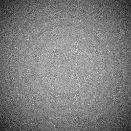 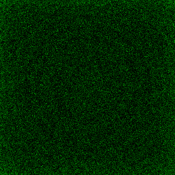 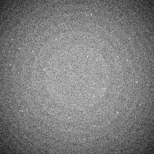 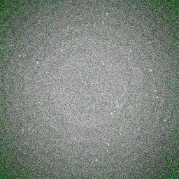

## blood_smear

Wright-Giemsa stained peripheral blood smear with RBCs, WBCs, and platelets.

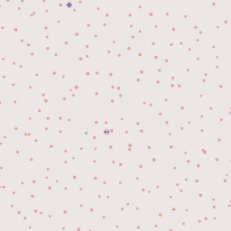 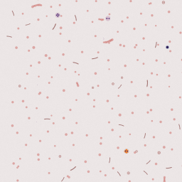 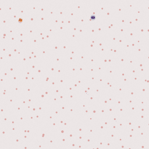 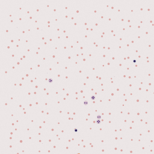

## calcium

FitzHugh-Nagumo calcium wave propagation with GCaMP fluorescence imaging.

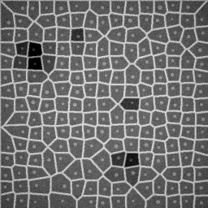 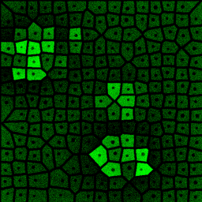 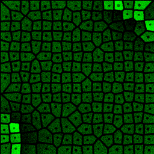 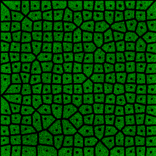

## cardio

Cardiac tissue with calcium transients, contraction, and arrhythmia modeling.

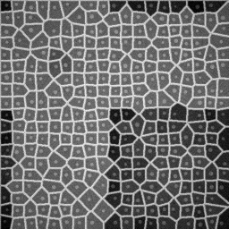 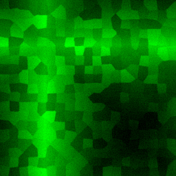 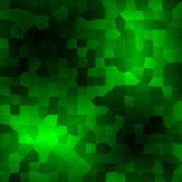 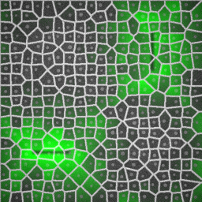

## celegans

C. elegans nematode with sinusoidal locomotion and transgenic fluorescence.

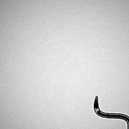 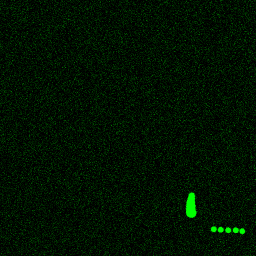 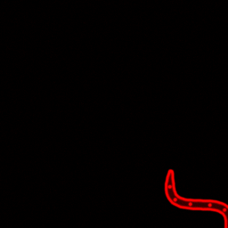 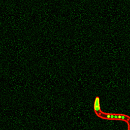

## colony_counter

Bacterial colony plates with spread/streak patterns and blue-white screening.

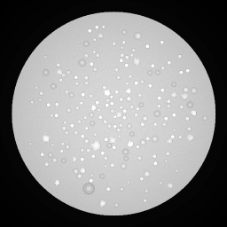 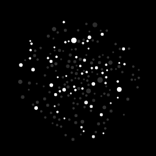 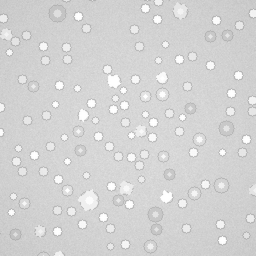 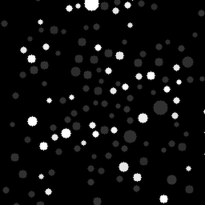

## dictyostelium

Dictyostelium aggregation with cAMP waves and chemotactic streaming.

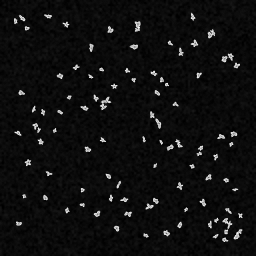 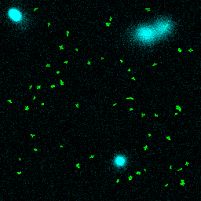 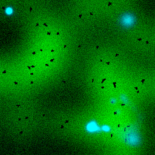 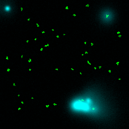

## fibroblast

Elongated fibroblasts with stress fibers, focal adhesions, and drug responses.

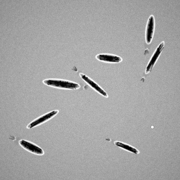 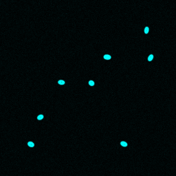 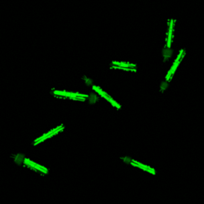 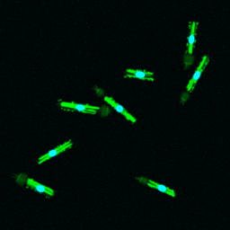

## fish

FISH (fluorescence in situ hybridization) probes on tissue sections.

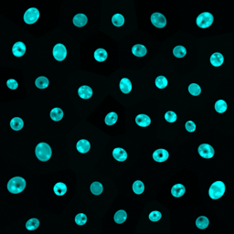 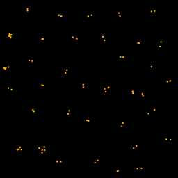 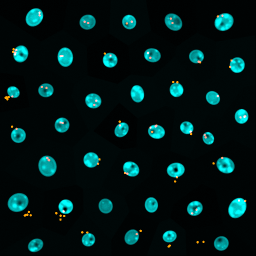 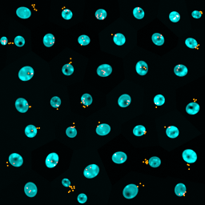

## flow_cytometry

Flow cytometry with FSC/SSC scatter and multi-color fluorescence channels.

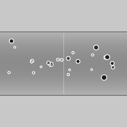 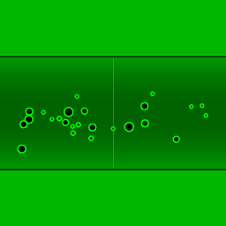 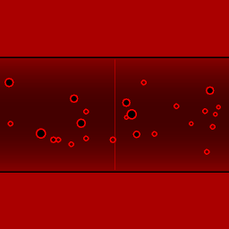 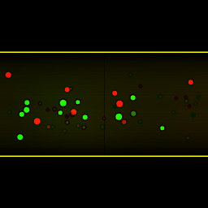

## fucci

FUCCI cell cycle reporter with G1-red (Cdt1) and S/G2/M-green (Geminin).

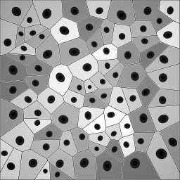 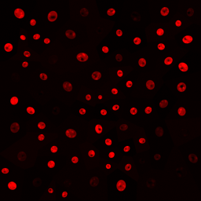 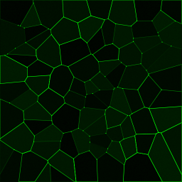 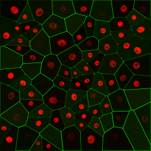

## gel_doc

Gel electrophoresis documentation: western blots, agarose gels, Coomassie staining.

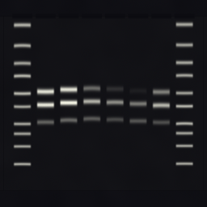 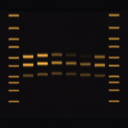 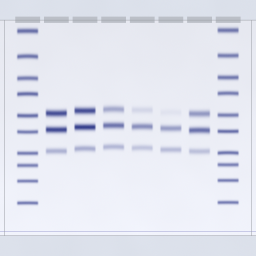 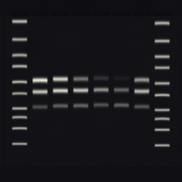

## hemocytometer

Neubauer hemocytometer with trypan blue viability staining and grid overlay.

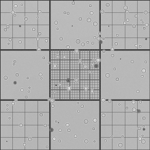 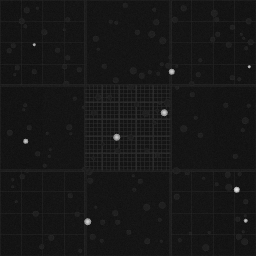  

## histology

H&E stained tissue histology sections with glandular architecture.

   

## lipid_droplet

Hepatocytes with lipid droplets (Nile Red) modeling steatosis.

   

## lysosome

LysoTracker-stained lysosomes with dynamic intracellular movement.

   

## malaria

Giemsa-stained blood smear with Plasmodium falciparum parasites at various stages.

   

## microfluidics

Microfluidic channel with flowing cells, traps, and chemical gradients.

   

## mito

Mitochondrial network with MitoTracker staining, fission, and fusion dynamics.

   

## neuron

Primary neurons with MAP2 dendrites and synaptophysin synaptic puncta.

   

## optogenetic

   

## organoid

3D organoid cross-section with lumen, epithelial layer, and E-cadherin staining.

   

## particle

Basic particle simulation with scattered fluorescent cells.

   

## plant_cell

Plant cells with cell walls, chloroplasts, and iodine/Calcofluor White staining.

   

## plate_reader

96-well microplate reader with viability, ELISA, and luminescence assays.

   

## reaction_diffusion

Gray-Scott reaction-diffusion patterns (Turing patterns, waves, spots).

   

## spheroid

Multicellular tumor spheroid with necrotic core and live/dead staining.

   

## spt

Single-particle tracking with free, confined, and directed diffusion modes.

   

## stress_granule

Stress granules (G3BP1) with dynamic formation and dissolution.

   

## viability

Live/dead cell viability assay with calcein-AM and propidium iodide.

   

## volvox

Volvox colonial algae with somatic cells and gonidia, chlorophyll fluorescence.

   

## voronoi

Basic Voronoi tissue simulation with brightfield, nucleus, and membrane channels.

   

## wound_healing

Scratch wound healing assay with cell migration and gap closure dynamics.

   

## yeast

Budding yeast (S. cerevisiae) with Calcofluor White bud scars and GFP reporter.

   

## zebrafish

Zebrafish embryo with transgenic vascular (flk1:GFP) and cardiac (myl7:mCherry) reporters.

   

