# Virtual Microscope — Backend Gallery

Generated showcase images for **34** of 34 backends.

Each row shows 4 representative images arranged in a horizontal strip.

## bacteria

Rod-shaped bacteria with phase contrast, GFP fluorescence, and colony growth dynamics.

## blood_smear

Wright-Giemsa stained peripheral blood smear with RBCs, WBCs, and platelets.

## calcium

FitzHugh-Nagumo calcium wave propagation with GCaMP fluorescence imaging.

## cardio

Cardiac tissue with calcium transients, contraction, and arrhythmia modeling.

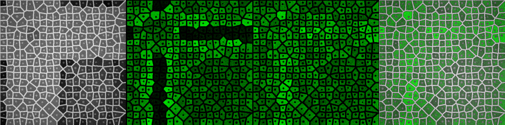

## celegans

C. elegans nematode with sinusoidal locomotion and transgenic fluorescence.

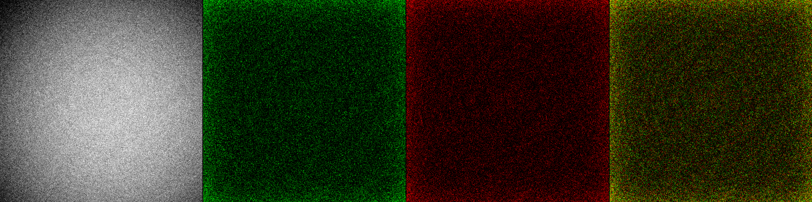

## colony_counter

Bacterial colony plates with spread/streak patterns and blue-white screening.

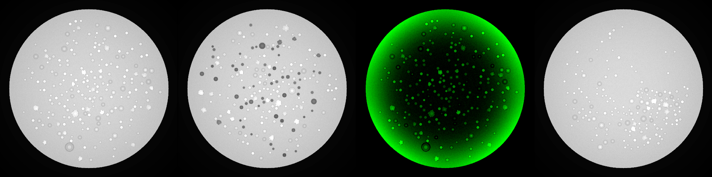

## dictyostelium

Dictyostelium aggregation with cAMP waves and chemotactic streaming.

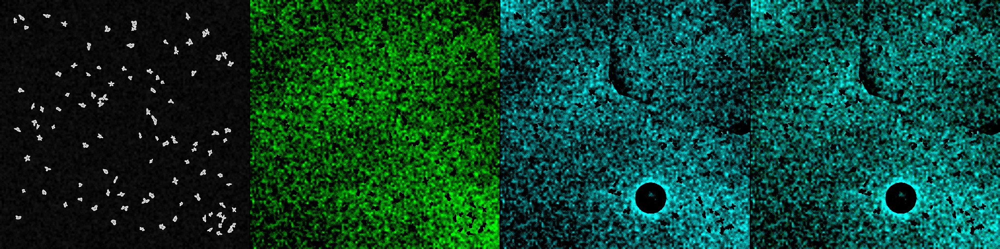

## fibroblast

Elongated fibroblasts with stress fibers, focal adhesions, and drug responses.

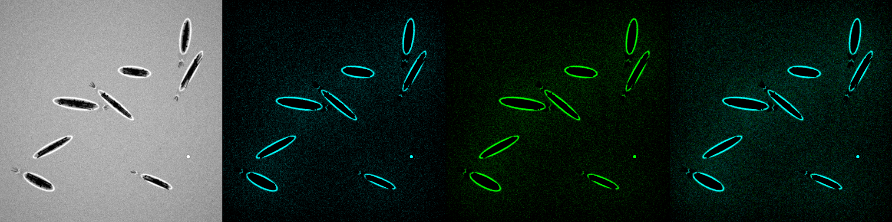

## fish

FISH (fluorescence in situ hybridization) probes on tissue sections.

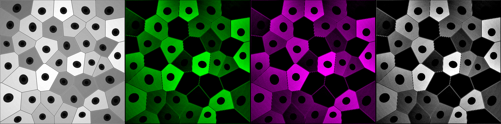

## flow_cytometry

Flow cytometry with FSC/SSC scatter and multi-color fluorescence channels.

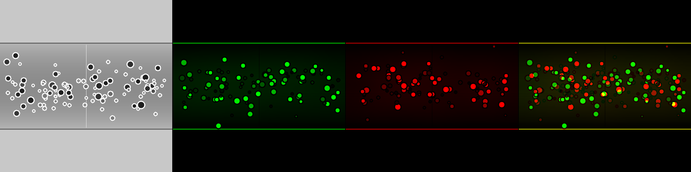

## fucci

FUCCI cell cycle reporter with G1-red (Cdt1) and S/G2/M-green (Geminin).

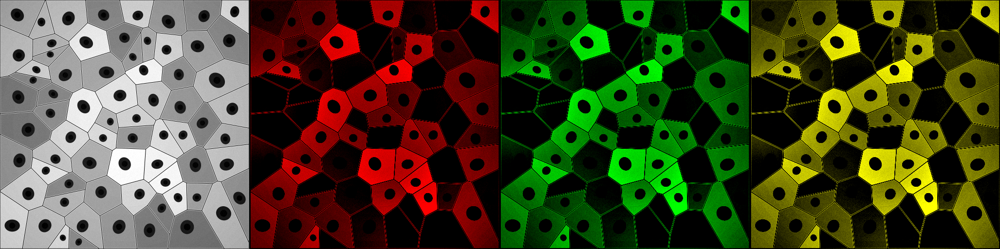

## gel_doc

Gel electrophoresis documentation: western blots, agarose gels, Coomassie staining.

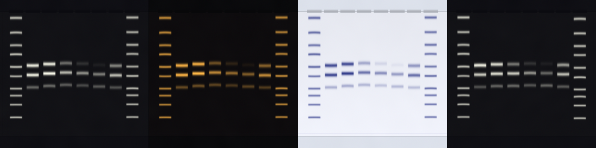

## hemocytometer

Neubauer hemocytometer with trypan blue viability staining and grid overlay.

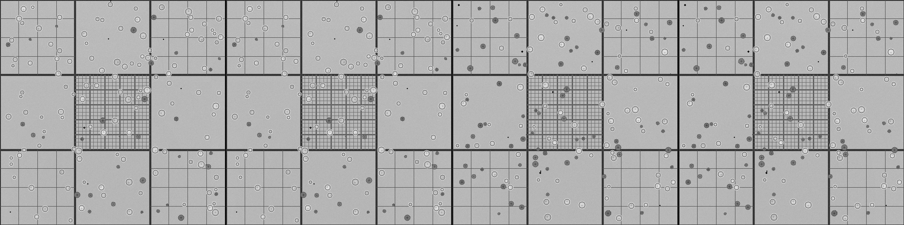

## histology

H&E stained tissue histology sections with glandular architecture.

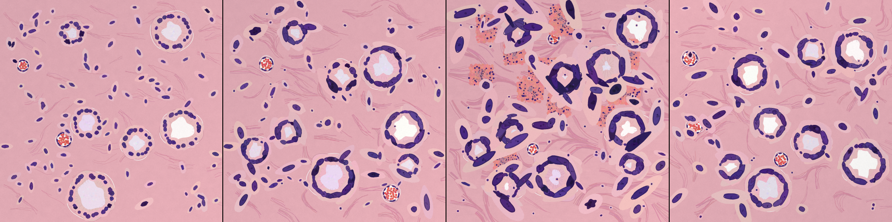

## lipid_droplet

Hepatocytes with lipid droplets (Nile Red) modeling steatosis.

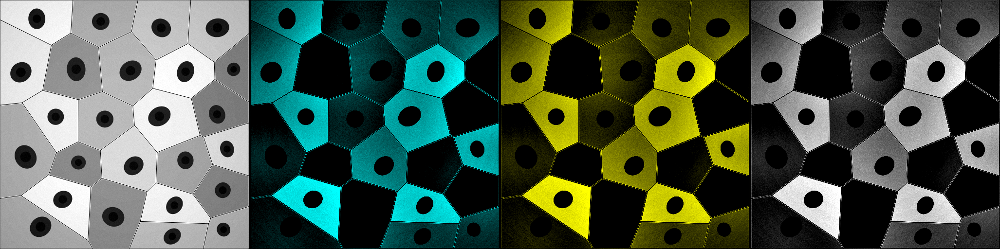

## lysosome

LysoTracker-stained lysosomes with dynamic intracellular movement.

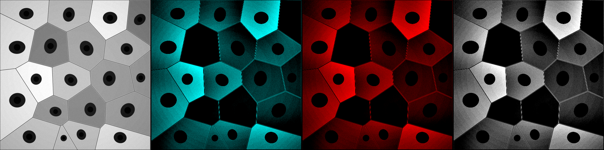

## malaria

Giemsa-stained blood smear with Plasmodium falciparum parasites at various stages.

## microfluidics

Microfluidic channel with flowing cells, traps, and chemical gradients.

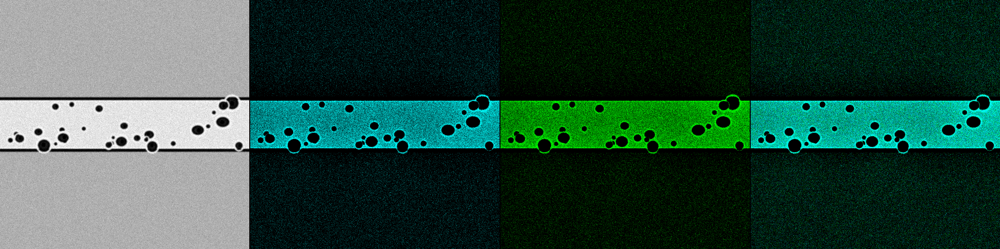

## mito

Mitochondrial network with MitoTracker staining, fission, and fusion dynamics.

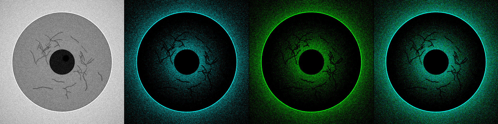

## neuron

Primary neurons with MAP2 dendrites and synaptophysin synaptic puncta.

## organoid

3D organoid cross-section with lumen, epithelial layer, and E-cadherin staining.

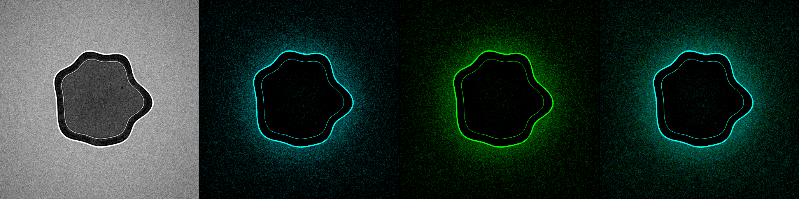

## particle

Basic particle simulation with scattered fluorescent cells.

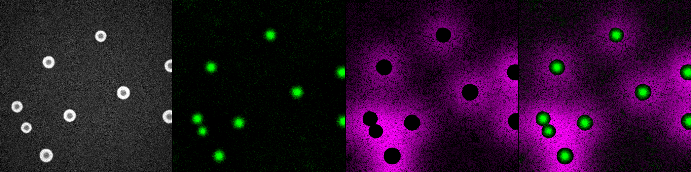

## plant_cell

Plant cells with cell walls, chloroplasts, and iodine/Calcofluor White staining.

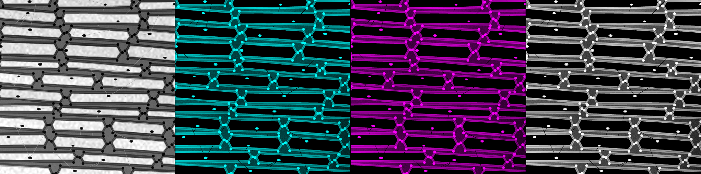

## plate_reader

96-well microplate reader with viability, ELISA, and luminescence assays.

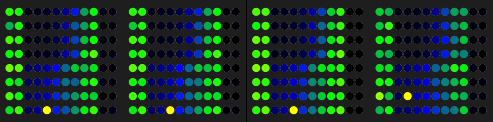

## reaction_diffusion

Gray-Scott reaction-diffusion patterns (Turing patterns, waves, spots).

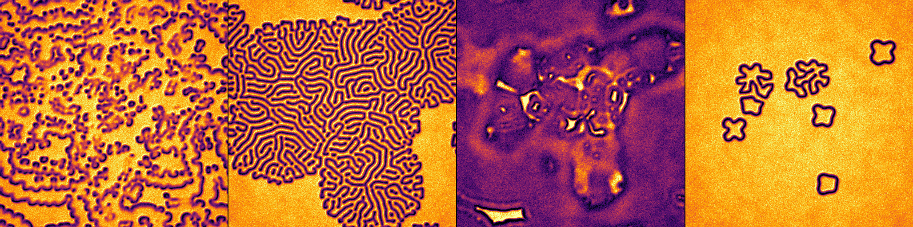

## spheroid

Multicellular tumor spheroid with necrotic core and live/dead staining.

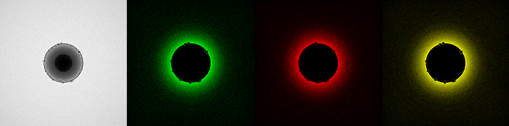

## spt

Single-particle tracking with free, confined, and directed diffusion modes.

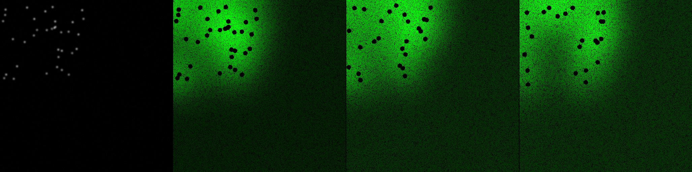

## stress_granule

Stress granules (G3BP1) with dynamic formation and dissolution.

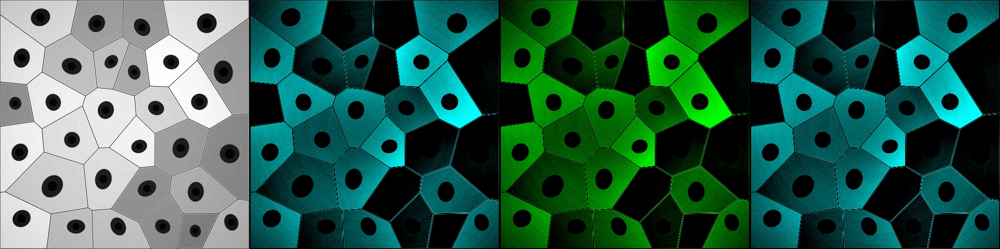

## viability

Live/dead cell viability assay with calcein-AM and propidium iodide.

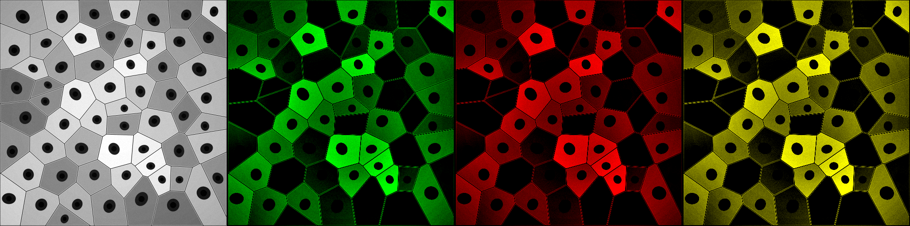

## volvox

Volvox colonial algae with somatic cells and gonidia, chlorophyll fluorescence.

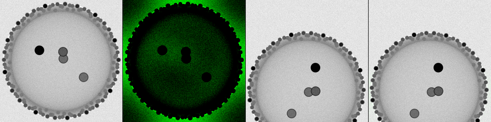

## voronoi

Basic Voronoi tissue simulation with brightfield, nucleus, and membrane channels.

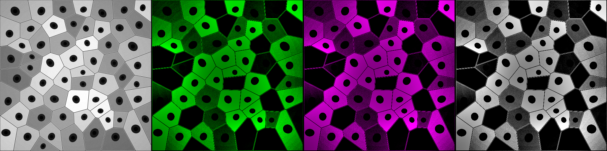

## wound_healing

Scratch wound healing assay with cell migration and gap closure dynamics.

## yeast

Budding yeast (S. cerevisiae) with Calcofluor White bud scars and GFP reporter.

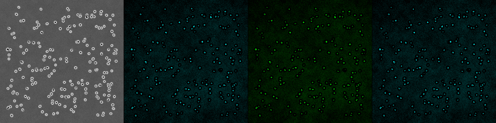

## zebrafish

Zebrafish embryo with transgenic vascular (flk1:GFP) and cardiac (myl7:mCherry) reporters.

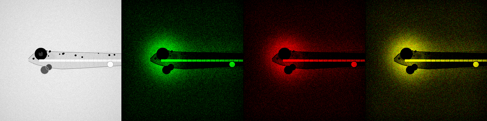
